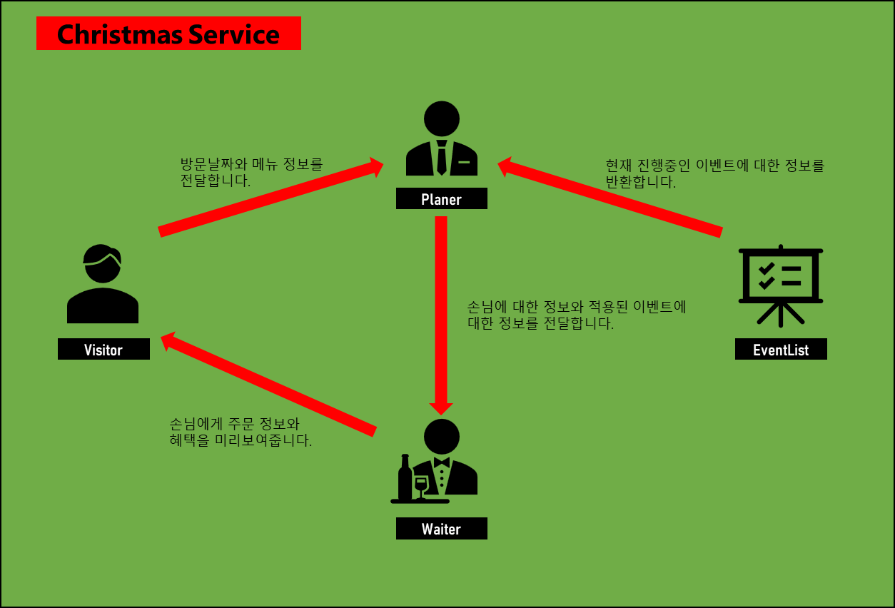

### 🎄❄️ Christmas  Promotion 기획 배경 ❄️🎄
>Christmas  Promotion 프로젝트는 고객들이 혜택을 많이 받는다는 것을 체감할 수 있게 하는 것이 목표로 고객이 방문한 날짜의 주문한 메뉴를 바탕으로 적용이 된 이벤트 내역을 미리보여줌으로서 많은 판매수익을 올리고 이벤트에 대한 좋은 이미지를 심어 내년 새해 이벤트에 대한 기대감과 참여도를 줄 수 있는 중요한 프로젝트입니다.

### 기능 구성도

### 기능 목록
#### ChristmasService (Controller)
>해당 프로그램에서의 데이터들을 관리하여 로직을 조작하는 Controller의 역할을 갖습니다.
- 주문 정보와 방문할 날짜를 관리한다.
- 적용이 가능한 이벤트 정보를 관리한다.
- 혜택을 미리 보여준다.

#### Visitor (Model)
>사용자는 방문객이 되어 방문객에 대한 정보를 입력합니다.
방문객은 다음과 같은 정보를 가지고 있습니다.
- OrderList
  - 사용자가 주문한 메뉴에 대한 정보를 가지고 있습니다.
    

      
예외상황

      

        
        - 중복 메뉴는 입력이 불가능하다.
        - 메뉴의 개수는 0 이하의 숫자를 입력이 불가능하다.
        - 메뉴는 최대 20개 까지만 주문이 가능하다. 그이상은 불가능하다.
        - 메뉴 형식이 예시와 다른 경우 입력이 불가능하다.
        - 음료만 주문시 주문이 불가능하다.
    
      

  

- VisitDateInformation
  - 사용자가 방문하는 날짜에 대한 정보를 가지고 있습니다.
    

      
예외상황

      

        
        - 날짜는 1일 ~ 31일 이어야한다.
    
      

  

#### Planer (Model)
>주어진 방문자 정보와 주문 메뉴에 대한 이벤트를 계획하고 적용합니다.
- EventList
  - 적용된 이벤트의 정보를 저장하고 관리합니다.
     

      
이벤트 내용

      

          
          - 크리스마스 디데이 할인 이벤트
          - 평일 할인 이벤트
          - 주말 할인 이벤트
          - 특별 할인 이벤트
          - 증정 이벤트
          - 뱃지 이벤트
      

    

#### Waiter (View)
>사용자가 입력한 주문과 적용된 이벤트 정보를 방문자(사용자)에게 보여주는 역할을 합니다.
